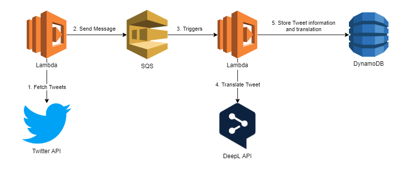

# DeepLive
Fetches Tweets from select users and translates them into English using DeepL.

## Architecture

1. FetchLatestTweets Lambda fetches latest Tweets from selected users
2. FetchLatestTweets Lambda sends message containg Tweet information to SQS
3. SQS triggers TranslateTweets Lambda
4. TranslateTweets Lambda translates Tweet using DeepL API
5. TranslateTweets Lambda stores Tweet translation in DynamoDB

## Deployment
- Deployment of infrastructure is done through [Terraform](https://www.terraform.io/)
- Lambda zip package is created using is done using `dotnet-lambda` from the AWS Extensions for .NET CLI [Amazon.Lambda.Tools](https://github.com/aws/aws-extensions-for-dotnet-cli#aws-lambda-amazonlambdatools)

